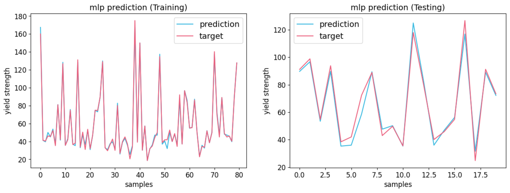
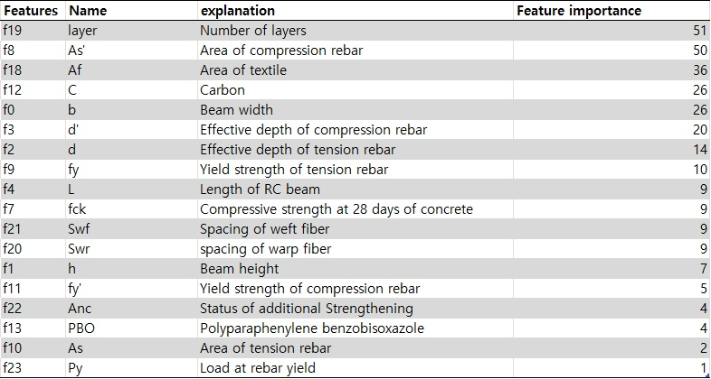
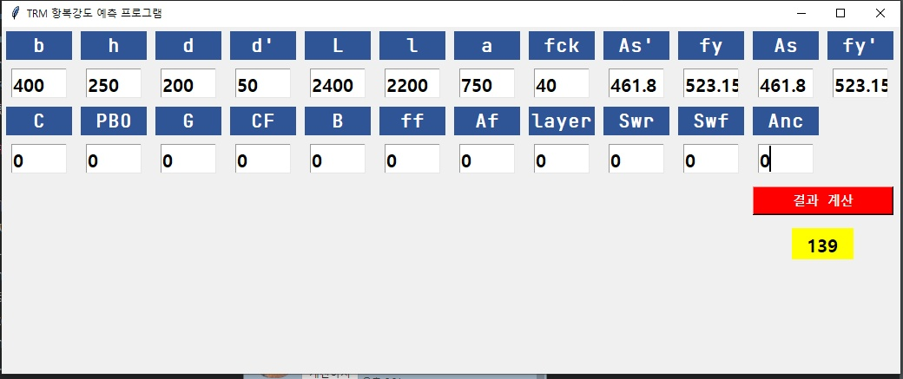

# TRM_strength_prediction

This repository contains the code(not providing dataset) for the following paper.
### Published paper
**Title**: "Analysis of load-bearing capacity factors of textile-reinforced mortar using multilayer perceptron and explainable artificial intelligence"

**Author**: Youngjae Song, Kwangsu Kim, Seunghee Park, Sun-Kyu Park, Jongho Park

**Journal**: Construction and Building Materials

**DOI**: https://doi.org/10.1016/j.conbuildmat.2022.129560

### Abstract
>With the aging of reinforced concrete structures, textiles, which are fiber composite materials, have been gaining attention for structural strengthening and replacement of steel reinforcements. The application of textile- reinforced mortar (TRM) is one method of strengthening structures using textiles. Various factors affect the performance when structures are strengthened with TRM; it is affected by the physical properties of the material, such as tensile strength and elongation, and external factors, which vary depending on the design condition, such as textile geometry and strengthening method. Therefore, it is necessary to develop an accurate method that considers the influence of various external factors for evaluating the load-bearing capacity in flexural of TRM- strengthened RC beam. A total of 100 experimental data were learned using a multilayer perceptron (MLP) deep learning model with 24 features, which were analyzed using explainable artificial intelligence, shapley additive explanations (SHAP). The MLP model exhibited a high performance, with a coefficient of determination of 0.9677, indicating the complex correlation between the given features. Regarding the influence of external factors on yield strength, the weft fiber spacing had a negative impact with high influence, and the warp fiber spacing was found to have a very low effect. The anchorage and the number of layers seemed to have a positive impact; however, the effect was small.

### Figures

### GUI.py usage

